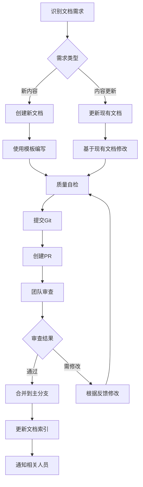

# MyWeb 项目文档维护规范

## 一、目的与范围

### 1.1 目的
本规范旨在建立 MyWeb 项目文档的标准化维护流程，确保文档的准确性、完整性、时效性和一致性，提高团队协作效率和项目可维护性。

### 1.2 适用范围
- 所有项目文档的创建、更新、审查和归档
- 所有项目成员（开发、测试、运维、管理等）
- 项目生命周期内的所有阶段（开发、测试、部署、运维）

### 1.3 基本原则
1. **文档即代码**：文档与代码同等重要，同步维护
2. **准确性优先**：文档内容必须准确反映实际状态
3. **及时更新**：代码变更时，相关文档必须及时更新
4. **易于访问**：文档组织结构清晰，易于查找和阅读

## 二、文档分类与标准

### 2.1 文档分类标准
| 类别 | 子类 | 示例文档 | 更新频率 | 负责人 |
|------|------|----------|----------|--------|
| **项目概述** | 整体介绍 | PROJECT-OVERVIEW.md | 月度 | 架构师 |
| **技术设计** | 架构设计 | 各模块设计文档 | 按需 | 模块负责人 |
| **开发日志** | 问题记录 | dev-logs/*.md | 按需 | 开发者 |
| **部署运维** | 部署指南 | DEPLOYMENT-PLAN.md | 季度 | DevOps |
| **API文档** | 接口说明 | 自动生成 + 补充说明 | 按需 | 后端开发 |
| **用户手册** | 使用指南 | 待创建 | 按需 | 产品经理 |
| **管理规范** | 维护规范 | 本文档 | 季度 | 文档维护员 |

### 2.2 文档质量标准
#### 2.2.1 内容质量标准
- **准确性**：内容与实际情况一致，无错误信息
- **完整性**：覆盖所有关键点，无重要信息缺失
- **一致性**：术语、格式、风格保持统一
- **可读性**：语言清晰，结构合理，易于理解
- **实用性**：提供实际可用的指导和示例

#### 2.2.2 格式质量标准
- **结构规范**：使用标准标题层级（#,##,###）
- **代码规范**：代码块注明语言，示例完整可运行
- **链接规范**：使用相对路径，确保链接有效
- **版本规范**：包含版本号和最后更新日期
- **图表规范**：图表清晰，有适当说明

## 三、文档生命周期管理

### 3.1 文档创建流程
```
需求识别 → 确定类型 → 创建模板 → 编写内容 → 内部审查 → 发布归档
```

#### 3.1.1 创建触发条件
1. **新模块开发**：开发新功能模块时
2. **重大架构调整**：系统架构有重大变化时
3. **问题解决方案**：解决重要技术问题后
4. **用户需求**：用户需要新的使用指南时
5. **流程规范**：需要标准化工作流程时

#### 3.1.2 模板使用
所有新文档应使用对应的模板创建：
- **开发日志模板**：记录问题解决和技术决策
- **设计文档模板**：记录架构设计和技术方案
- **用户指南模板**：记录使用方法和操作步骤
- **API文档模板**：记录接口说明和使用示例

### 3.2 文档更新流程
```
变更识别 → 影响分析 → 内容更新 → 版本标记 → 审查确认 → 同步发布
```

#### 3.2.1 更新触发条件
1. **代码变更**：当相关代码有变更时
2. **配置变更**：当系统配置有变更时
3. **问题修复**：当文档内容有错误时
4. **用户反馈**：当用户反馈文档问题时
5. **定期审查**：按照审查计划进行更新

#### 3.2.2 版本管理规则
1. **版本号格式**：v{主版本}.{次版本} (如 v2.8)
2. **版本更新规则**：
   - 主版本更新：重大架构调整或完全重写
   - 次版本更新：重要功能新增或重大内容更新
   - 小修改：修复错误、更新示例、格式调整（不更新版本号）
3. **版本记录**：在文档末尾记录版本变更历史

### 3.3 文档审查流程
```
提交审查 → 技术审查 → 格式审查 → 问题反馈 → 修改确认 → 审查通过
```

#### 3.3.1 审查类型
1. **技术审查**：由技术专家审查内容准确性
2. **格式审查**：由文档维护员审查格式规范性
3. **同行审查**：由相关开发人员交叉审查
4. **用户审查**：由最终用户审查实用性和可读性

#### 3.3.2 审查周期
| 文档类型 | 审查频率 | 审查方式 | 审查负责人 |
|----------|----------|----------|------------|
| 项目概述 | 月度 | 团队会议 | 架构师 |
| 技术设计 | 按需 | 同行审查 | 模块负责人 |
| 开发日志 | 按需 | 作者自查 | 开发者 |
| 部署运维 | 季度 | 专门审查 | DevOps |
| API文档 | 按需 | 自动化+人工 | 后端开发 |

### 3.4 文档归档流程
```
状态确认 → 版本锁定 → 备份存储 → 索引更新 → 访问控制
```

#### 3.4.1 归档条件
1. **项目阶段结束**：如开发阶段结束
2. **文档版本稳定**：长时间无变更需求
3. **替代文档出现**：有新版本替代旧版本
4. **项目终止**：项目停止维护

#### 3.4.2 归档要求
1. **版本锁定**：归档文档不再更新
2. **备份存储**：多地点备份，确保安全
3. **访问控制**：设置适当的访问权限
4. **索引更新**：在文档索引中标记归档状态

## 四、文档维护责任

### 4.1 角色与职责
| 角色 | 主要职责 | 具体任务 |
|------|----------|----------|
| **文档维护员** | 文档体系管理 | 1. 维护文档索引和规范<br>2. 监督文档质量<br>3. 组织文档审查<br>4. 培训文档编写 |
| **架构师** | 项目概述文档 | 1. 维护项目整体概述<br>2. 更新系统架构图<br>3. 审查技术设计文档 |
| **模块负责人** | 模块技术文档 | 1. 维护模块设计文档<br>2. 审查开发日志<br>3. 确保文档与技术同步 |
| **开发者** | 开发日志 | 1. 记录开发过程和问题<br>2. 及时更新相关文档<br>3. 参与文档审查 |
| **DevOps** | 部署运维文档 | 1. 维护部署指南<br>2. 更新配置说明<br>3. 记录运维问题 |
| **产品经理** | 用户文档 | 1. 维护用户指南<br>2. 收集用户反馈<br>3. 更新功能说明 |

### 4.2 责任矩阵
| 文档类型 | 主要负责人 | 次要负责人 | 参与人员 |
|----------|------------|------------|----------|
| PROJECT-OVERVIEW.md | 架构师 | 文档维护员 | 所有模块负责人 |
| DEPLOYMENT-PLAN.md | DevOps | 架构师 | 运维团队 |
| dev-logs/*.md | 各模块开发者 | 模块负责人 | 相关开发人员 |
| 设计文档 | 模块负责人 | 架构师 | 开发团队 |
| API文档 | 后端开发 | 模块负责人 | 前端开发 |
| 用户手册 | 产品经理 | 模块负责人 | 测试人员 |

## 五、文档编写规范

### 5.1 内容组织规范
#### 5.1.1 标准章节结构
1. **概述部分**：文档目的、范围、背景
2. **核心内容**：详细说明、技术方案、操作步骤
3. **参考信息**：相关文档、资源链接、术语解释
4. **附录部分**：补充材料、版本历史、联系方式

#### 5.1.2 信息层级要求
- 一级标题 (#)：文档标题
- 二级标题 (##)：主要章节
- 三级标题 (###)：子章节
- 四级标题 (####)：小节
- 避免使用五级及以上标题

### 5.2 格式规范
#### 5.2.1 Markdown 规范
1. **标题**：使用规范的标题标记，前后空行
2. **列表**：有序列表使用数字，无序列表使用 `-` 或 `*`
3. **代码块**：使用三个反引号，注明语言类型
4. **表格**：使用规范的表格语法，保持对齐
5. **链接**：使用 `[文本](链接)` 格式，优先使用相对路径
6. **图片**：使用 `` 格式，提供替代文本

#### 5.2.2 代码示例规范
```markdown
```python
# 示例代码
def example_function():
    """函数说明"""
    return "Hello World"
```

注意事项：
1. 代码应完整可运行，或提供必要的上下文
2. 复杂代码应添加详细注释
3. 关键部分应突出显示或加粗
4. 避免过长的代码块，适当拆分
```

#### 5.2.3 术语和命名规范
1. **技术术语**：使用标准术语，首次出现时简要说明
2. **产品名称**：保持一致性，使用全称或标准缩写
3. **变量命名**：与代码保持一致，使用代码字体
4. **版本号**：使用标准格式，如 v2.8、1.0.0

### 5.3 质量检查清单
在提交文档前，请检查以下项目：

#### 5.3.1 内容检查
- [ ] 目的和范围是否清晰
- [ ] 内容是否准确无误
- [ ] 关键信息是否完整
- [ ] 术语使用是否一致
- [ ] 示例是否准确有效

#### 5.3.2 格式检查
- [ ] 标题层级是否正确
- [ ] 代码块格式是否正确
- [ ] 链接是否有效
- [ ] 表格是否对齐
- [ ] 图片是否正常显示

#### 5.3.3 结构检查
- [ ] 文档结构是否合理
- [ ] 章节顺序是否逻辑
- [ ] 信息组织是否清晰
- [ ] 阅读路径是否顺畅
- [ ] 查找信息是否方便

## 六、文档工具与流程

### 6.1 工具栈
| 工具类型 | 工具名称 | 用途 | 使用规范 |
|----------|----------|------|----------|
| **编辑工具** | VS Code | 文档编写 | 安装Markdown插件，使用项目统一配置 |
| **版本控制** | Git | 文档管理 | 与代码同步提交，使用规范提交信息 |
| **审查工具** | GitHub PR | 文档审查 | 使用PR流程，添加文档审查标签 |
| **自动化工具** | Markdown Lint | 格式检查 | 配置项目统一规则，集成到CI/CD |
| **图表工具** | Mermaid | 绘制图表 | 使用标准语法，确保可读性 |
| **备份工具** | 云存储/Git | 文档备份 | 定期备份，多地点存储 |

### 6.2 工作流程

#### 6.2.1 日常更新流程


#### 6.2.2 定期审查流程
1. **月度审查**（每月第一个工作日）：
   - 审查 PROJECT-OVERVIEW.md
   - 更新项目状态和下一步计划
   - 由架构师负责组织

2. **季度审查**（每季度第一个工作日）：
   - 审查所有核心文档
   - 评估文档质量和时效性
   - 制定下一季度维护计划
   - 由文档维护员负责组织

3. **年度审查**（每年第一个工作日）：
   - 全面审查文档体系
   - 评估文档维护规范有效性
   - 制定年度文档改进计划
   - 由项目负责人组织

### 6.3 集成到开发流程
#### 6.3.1 Git 流程集成
1. **分支策略**：
   - 文档更新使用独立分支，命名规范：`docs/{简短描述}`
   - 与代码更新分离，便于单独审查和部署

2. **提交规范**：
   ```
   文档类型: 简要描述
    
    详细说明变更内容，包括：
    - 变更原因
    - 主要内容
    - 影响范围
    
    关联文档：文档路径
    关联任务：任务编号
   ```

3. **PR 模板**：
   ```markdown
   ## 文档变更说明
   
   ### 变更类型
   - [ ] 新文档
   - [ ] 内容更新
   - [ ] 错误修复
   - [ ] 格式优化
   
   ### 变更内容
   （详细描述变更内容）
   
   ### 审查要点
   - [ ] 内容准确性
   - [ ] 格式规范性
   - [ ] 链接有效性
   - [ ] 示例正确性
   
   ### 测试验证
   （描述如何测试或验证变更）
   ```

#### 6.3.2 CI/CD 集成
1. **自动化检查**：
   - Markdown 语法检查
   - 死链接检测
   - 代码示例语法检查
   - 版本号格式验证

2. **自动化构建**：
   - 文档站点自动构建
   - PDF 版本自动生成
   - 索引自动更新

3. **自动化发布**：
   - 文档站点自动部署
   - 变更通知自动发送
   - 备份自动执行

## 七、文档质量管理

### 7.1 质量指标
| 指标 | 计算公式 | 目标值 | 测量频率 |
|------|----------|--------|----------|
| **文档覆盖率** | (有文档的模块数/总模块数)×100% | ≥95% | 月度 |
| **文档时效性** | (30天内更新的文档数/总文档数)×100% | ≥80% | 月度 |
| **错误率** | (有错误的文档数/总文档数)×100% | ≤5% | 月度 |
| **审查通过率** | (审查通过的PR数/总PR数)×100% | ≥90% | 月度 |
| **用户满意度** | 用户满意度调查得分 | ≥4.0/5.0 | 季度 |

### 7.2 质量改进
#### 7.2.1 问题处理流程
1. **问题发现**：通过审查、测试、用户反馈等途径
2. **问题记录**：在问题跟踪系统记录，分类标记
3. **问题分析**：分析原因，确定影响范围
4. **解决方案**：制定解决方案，分配责任人
5. **实施修复**：按照文档更新流程实施修复
6. **验证关闭**：验证修复效果，关闭问题

#### 7.2.2 持续改进
1. **定期回顾**：每月回顾文档质量问题
2. **根本原因分析**：分析常见问题的根本原因
3. **过程改进**：改进文档维护流程和规范
4. **工具改进**：改进文档工具和自动化
5. **培训改进**：改进文档编写培训材料

### 7.3 质量评估报告
每月生成文档质量评估报告，包括：
1. **质量指标趋势**：各项指标的月度变化
2. **问题分析**：主要问题和改进措施
3. **优秀实践**：值得推广的优秀实践
4. **改进建议**：下一阶段的改进建议

## 八、培训与支持

### 8.1 培训计划
#### 8.1.1 新成员培训
1. **入职培训**（入职第一周）：
   - 文档体系介绍
   - 文档维护规范讲解
   - 工具使用培训
   - 实际编写练习

2. **进阶培训**（入职第一个月）：
   - 高级文档编写技巧
   - 文档审查流程实践
   - 问题分析和解决

#### 8.1.2 定期培训
1. **季度培训**（每季度一次）：
   - 文档规范更新说明
   - 工具新功能介绍
   - 优秀文档案例分享
   - 常见问题解答

2. **专题培训**（按需组织）：
   - API文档编写专题
   - 用户手册编写专题
   - 技术设计文档专题

### 8.2 支持体系
1. **文档维护员支持**：
   - 提供文档编写咨询
   - 解决文档工具问题
   - 协助文档审查

2. **知识库支持**：
   - 常见问题解答（FAQ）
   - 编写技巧和示例
   - 模板和工具下载

3. **社区支持**：
   - 文档编写讨论组
   - 经验分享会
   - 同行互助

## 九、附录

### 9.1 模板示例
#### 9.1.1 开发日志模板
```markdown
# [模块名称] 开发日志

## 一、问题背景
（描述遇到的问题或开发的任务）

## 二、问题分析
（分析问题原因，可能的解决方案）

## 三、解决方案
（详细描述采用的解决方案）

## 四、实施步骤
1. 步骤一
2. 步骤二
3. 步骤三

## 五、验证结果
（描述验证方法和结果）

## 六、经验总结
（总结经验和教训）

## 七、相关文档
- [文档1](链接)
- [文档2](链接)

---
**记录人**: [姓名]
**记录时间**: [日期]
**版本**: v1.0
```

#### 9.1.2 技术设计文档模板
```markdown
# [模块名称] 技术设计文档

## 一、设计目标
（描述设计的目标和需求）

## 二、系统架构
（描述系统架构，可包含架构图）

## 三、详细设计
### 3.1 模块设计
（模块详细设计）

### 3.2 接口设计
（接口详细设计）

### 3.3 数据库设计
（数据库表结构设计）

## 四、技术选型
（描述技术选型和理由）

## 五、实施计划
（描述实施步骤和时间计划）

## 六、风险评估
（识别风险和应对措施）

---
**设计人**: [姓名]
**设计时间**: [日期]
**版本**: v1.0
```

### 9.2 检查清单
#### 9.2.1 文档提交前检查清单
- [ ] 文档目的和范围是否明确
- [ ] 内容是否准确完整
- [ ] 格式是否符合规范
- [ ] 代码示例是否正确
- [ ] 链接是否有效
- [ ] 版本信息是否更新
- [ ] 审查要点是否完成

#### 9.2.2 文档审查检查清单
- [ ] 技术内容是否正确
- [ ] 文档结构是否合理
- [ ] 语言表达是否清晰
- [ ] 示例是否恰当
- [ ] 是否符合项目规范
- [ ] 是否易于理解和维护

### 9.3 变更记录
| 版本 | 变更内容 | 变更人 | 变更时间 |
|------|----------|--------|----------|
| v1.0 | 初始版本 | 文档维护小组 | 2026-01-22 |
| v1.1 | 增加模板示例 | 文档维护员 | 2026-01-22 |

### 9.4 联系方式
- **文档维护员**：[姓名]
- **问题反馈**：[邮箱/内部通讯工具]
- **紧急联系**：[电话号码]

---
**文档版本**: v1.0  
**创建日期**: 2026年1月22日  
**最后更新**: 2026年1月22日  
**维护团队**: 文档维护小组  

**下一步行动**:
1. 团队评审此维护规范
2. 建立文档维护工具和流程
3. 组织团队成员培训
4. 实施文档质量监控
